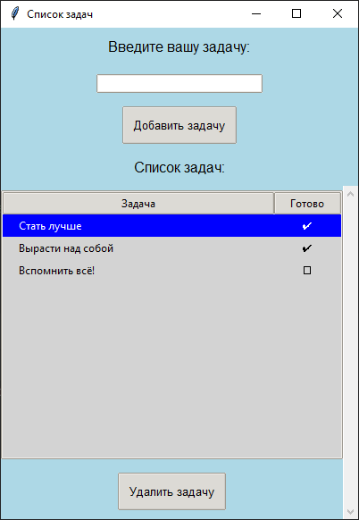

# Task manager
Progam manager

## Задачи проекта: 
Разработать приложения для управления задачами, которое удобно использовать для 
организации и упорядочивания своих планов на ближайшее время.
## Возможности программы: 
* добавлять задачи;
* помечать задачи выполненными;
* удалять задачи.

